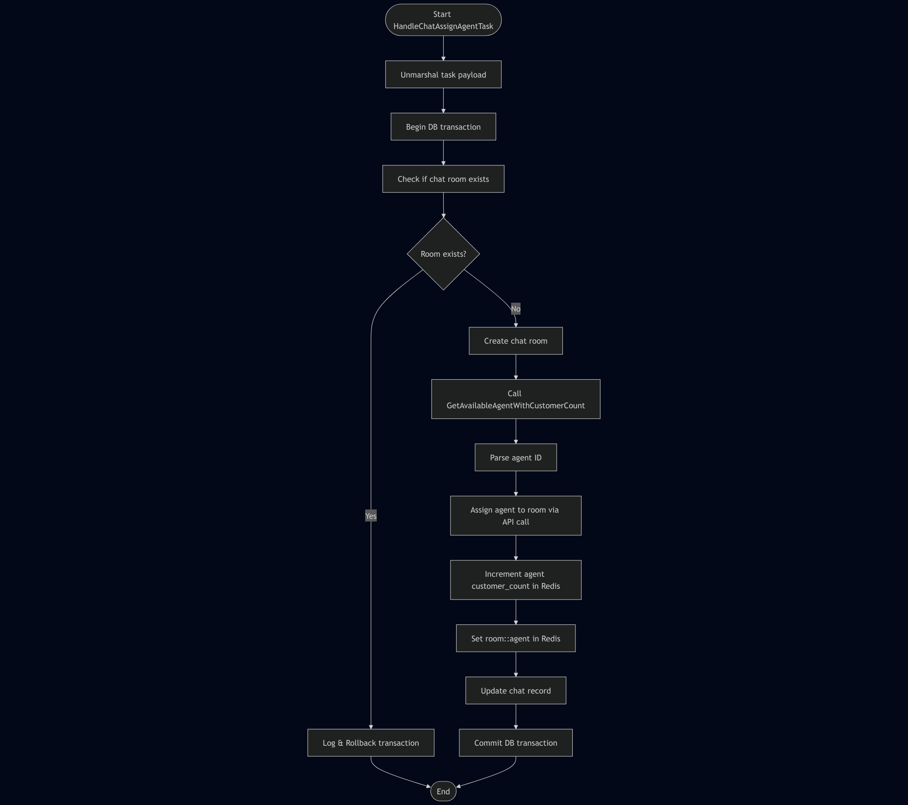
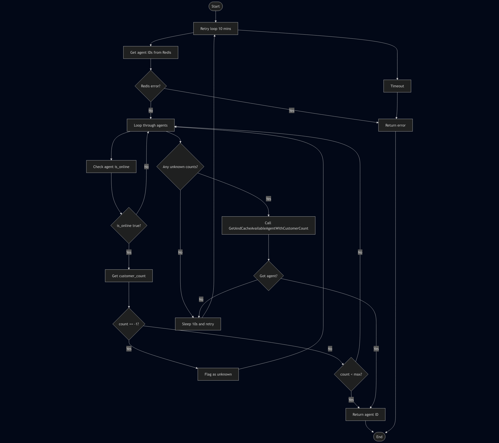
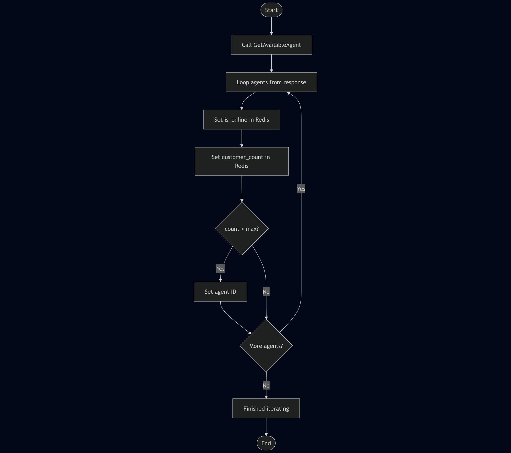

# Qiscus Test

This projects aims to solve a problem where system needs to assign available agents into customer chat room based on certain rules.

The rules is as follows:

- Assign to only online agent
- Each agents have a set amount of customer count
- Chat need to be assigned in FIFO order

## Requirements

- Redis
- Postgresql

## Configs

You can copy the `config.example.yml` file into `config.yml` and configure it as you need.
By default it will load config file from a file named `config.yml` but you can configure it when running it with flag `-c /path/to/config.yml`

## Builds

To build this service run

```
go run build .
```

## Webhook service

This service is used to receive two webhook that needs to be processed

### How to run

To run this service you can use command

```
./sebastian -e webhook
```

### Allocate agent webhook

This webhook receive payload, parse it and push the data to redis queue using asynq package.

### Mark as solved webhook

This webhook receive payload, parse it and find the corresponding agent assigned into that room.
If assigned agent found, decrease the current customer counter.

## Worker service

This service manage the processing of messages.

### How to run

To run this service you can use command

```
./sebastian -e worker
```

### Flow

### Init

The first time worker service running it will get all the agents and cache it in redis. After that it will spun a new goroutine that periodically update the online status of agents and or if there's any agent creation/deleteion.

#### Task handler

```
flowchart TD
    A([Start HandleChatAssignAgentTask]) --> B[Unmarshal task payload]
    B --> C[Begin DB transaction]
    C --> D[Check if chat room exists]
    D --> E{Room exists?}
    E -- Yes --> F[Log & Rollback transaction] --> Z([End])
    E -- No --> G[Create chat room]

    G --> H[Call GetAvailableAgentWithCustomerCount]

    H --> I[Parse agent ID]
    I --> J[Assign agent to room via API call]
    J --> K[Increment agent customer_count in Redis]
    K --> L[Set room:<room_id>:agent in Redis]
    L --> M[Update chat record]

    M --> N[Commit DB transaction]
    N --> Z
```



#### GetAvailableAgentWithCustomerCount

```
flowchart TD
        H0([Start]) --> H1
        H1[Retry loop 10 mins] --> H2[Get agent IDs from Redis]
        H2 --> H3{Redis error?}
        H3 -- Yes --> HErr
        H3 -- No --> H4[Loop through agents]
        H4 --> H5[Check agent is_online]
        H5 --> H6{is_online true?}
        H6 -- No --> H4
        H6 -- Yes --> H7[Get customer_count]
        H7 --> H8{count == -1?}
        H8 -- Yes --> H9[Flag as unknown] --> H4
        H8 -- No --> H10{count < max?}
        H10 -- Yes --> HDone
        H10 -- No --> H4
        H4 --> H12{Any unknown counts?}
        H12 -- No --> H13[Sleep 10s and retry]
        H13 --> H1
        H12 -- Yes --> H14[Call GetAndCacheAvailableAgentWithCustomerCount]
        H14 --> H15{Got agent?}
        H15 -- Yes --> HDone
        H15 -- No --> H13
        HDone[Return agent ID] --> HEnd
        HErr[Return error] --> HEnd
        HEnd([End])
        H1 --> HTimeout[Timeout] --> HErr
```



#### GetAndCacheAvailableAgentWithCustomerCount

```
flowchart TD
    S0([Start]) --> S1[Call GetAvailableAgent]
    S1 --> S2[Loop agents from response]
    S2 --> S3[Set is_online in Redis]
    S3 --> S4[Set customer_count in Redis]
    S4 --> S5{count < max?}
    S5 -- Yes --> S6[Set agent ID]
    S6 --> S8
    S5 -- No --> S8{More agents?}
    S8 -- Yes --> S2
    S8 -- No --> S9[Finished iterating]
    S9 --> SEnd([End])

```



## Helper

You need to set webhook url for this to work. After changing the configs related to Qiscus API, run your prefered tunneling service (in my case cloudflare tunnel) to get public url. Then change the webhook base url and build the binary.

Now you need to hit `localhost:3000/set-webhook` to set the webhook in Qiscus system using the url in the config.
